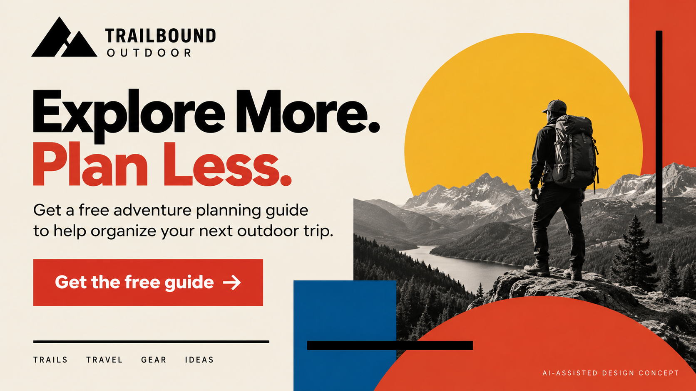

# The Explorer Archetype

## 1. What is it?

The Explorer archetype represents independence, freedom, discovery, and the desire to experience something new. Explorer brands encourage people to step outside their comfort zones and discover new places, ideas, or experiences.

The main goal of the Explorer archetype is to help people feel free and independent. Common characteristics include adventure, curiosity, individuality, discovery, and freedom.

## 2. How do you recognize or use it?

The Explorer archetype works well for brands connected to adventure, travel, outdoor activities, independence, and personal discovery.

Explorer brands often use images of nature, open spaces, roads, mountains, travel, and outdoor activities. Their language usually emphasizes freedom, adventure, exploration, and trying something different.

## 3. Examples

### Jeep

Jeep is commonly associated with the Explorer archetype because its branding focuses on adventure, outdoor experiences, and exploring places beyond everyday surroundings. Its marketing often connects its vehicles with outdoor travel and exploration.

### National Geographic

National Geographic can also represent the Explorer archetype because its content encourages people to discover places, cultures, wildlife, and the natural world. Its photography and storytelling focus strongly on exploration and discovery.

### Hero Design 1 — Modernist

**Brand:** Trailbound Outdoor

**Offer:** Free Adventure Planning Guide

**Archetype:** Explorer

**Design Style:** Bauhaus

**Persuasion Principle:** Reciprocity

**Headline:** Explore More. Plan Less.

**Supporting copy:** Get a free adventure planning guide to help organize your next outdoor trip.

**Call to action:** Get the free guide

*AI-generated hero image — labeled as an AI-assisted design concept.*

The Bauhaus approach uses functional layouts, geometric forms, simple typography, and an organized visual structure. These choices support the Explorer archetype by keeping the message clear and focused on the experience of exploration. Reciprocity is applied by offering a useful adventure planning guide for free.

**Style reference:** [Bauhaus-Archiv](https://www.bauhaus.de/en/)

### Hero Design 2 — Postmodernist

**Brand:** Trailbound Outdoor

**Offer:** Free Adventure Planning Guide

**Archetype:** Explorer

**Design Style:** Memphis Design

**Persuasion Principle:** Social Proof

**Headline:** Explore More. Plan Less.

**Supporting copy:** Find inspiration for your next adventure and get our free planning guide.

**Call to action:** Get the free guide

*AI-generated hero image — labeled as an AI-assisted design concept.*
Memphis Design uses bright colors, geometric shapes, playful patterns, and energetic compositions. These characteristics can give the Explorer message a more playful and expressive appearance. Social Proof can be applied through real customer reviews, verified community recommendations, or documented user experiences rather than invented testimonials.

**Style reference:** [Design Museum — Memphis Group](https://designmuseum.org/discover-design/all-stories/memphis-group-awful-or-awesome)

## 4. Sources

- [HubSpot, “How to create a brand archetype for your business.”](https://blog.hubspot.com/marketing/brand-archetypes)
- [The Hartford, “The 12 Brand Archetypes.”](https://www.thehartford.com/business-insurance/strategy/brand-archetypes/choosing-brand-archetype)
- [Project Kingmaker, “The Explorer Brand Archetype.”](https://projectkingmaker.com/the-12-archetypes/the-explorer)
- [Bauhaus-Archiv](https://www.bauhaus.de/en/)
- [Design Museum, “Memphis Group: awful or awesome?”](https://designmuseum.org/discover-design/all-stories/memphis-group-awful-or-awesome)

Generated images are labeled as AI-assisted design concepts. No fictional testimonials, customer numbers, or other evidence are presented as factual.
